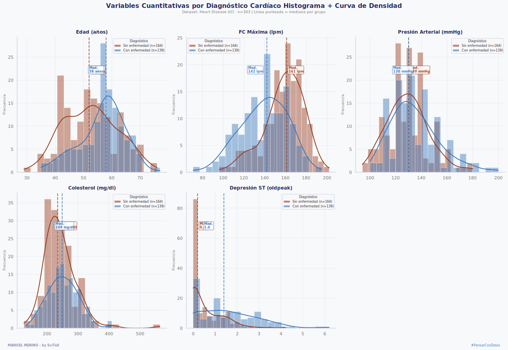
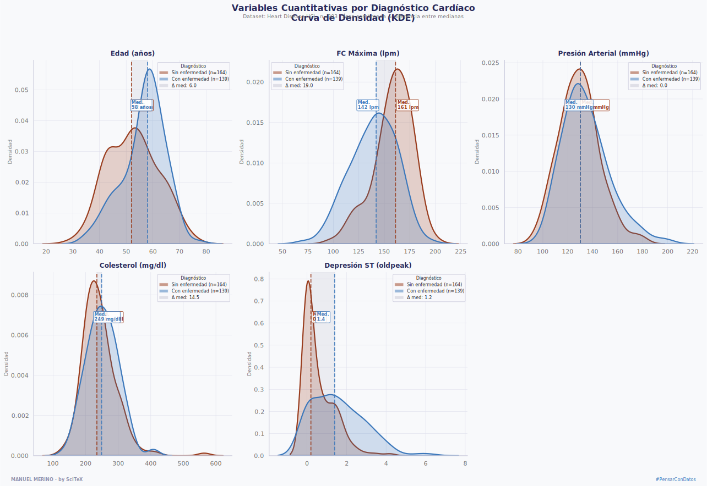

# EDA · Heart Disease UCI
### Análisis Exploratorio de Datos con Python y Seaborn
**by SciTeX · Manuel Merino** · #PensarConDatos

---

## Descripción

Serie de visualizaciones sobre el dataset **Heart Disease UCI** 
(Cleveland, n=303) explorando las variables clínicas que 
discriminan entre pacientes con y sin enfermedad cardíaca.

Cada gráfico fue publicado como contenido educativo en LinkedIn 
bajo la cuenta de [SciTeX](https://www.linkedin.com/company/scitexoficial).

---

## Dataset

**Fuente:** [UCI Machine Learning Repository — Heart Disease](https://archive.ics.uci.edu/dataset/45/heart+disease)

**Variables principales:**

| Variable | Descripción |
|---|---|
| `age` | Edad en años |
| `sex` | Sexo (1=hombre, 0=mujer) |
| `cp` | Tipo de dolor en el pecho |
| `trestbps` | Presión arterial en reposo (mmHg) |
| `chol` | Colesterol sérico (mg/dl) |
| `thalach` | Frecuencia cardíaca máxima (lpm) |
| `oldpeak` | Depresión del segmento ST |
| `exang` | Angina inducida por esfuerzo |
| `target` | Diagnóstico (1=con enfermedad, 0=sin enfermedad) |

---

## Gráficos

### 01 · Frecuencia Cardíaca Máxima — Histograma + Densidad
Distribución de `thalach` comparada entre pacientes con y sin 
enfermedad cardíaca. Muestra la frecuencia real de los datos 
con curva KDE superpuesta.


---

### 02 · Frecuencia Cardíaca Máxima — Curva de Densidad (KDE)
Misma variable que el gráfico anterior pero con KDE puro. 
Elimina el ruido visual de las barras y hace visible la 
separación entre grupos a través del área sombreada entre medianas.


---

### 03 · Histplot vs KDE — Comparativa
Panel comparativo de ambos formatos aplicados a la misma variable.
Incluye tabla de ventajas, desventajas y criterios de uso de cada uno.


---

### 04 · Panel — Todas las Variables · Histograma + Densidad
Las 5 variables cuantitativas del dataset comparadas entre grupos
en un solo panel: edad, FC máxima, presión arterial, colesterol
y depresión ST.



---

### 05 · Panel — Todas las Variables · Curva de Densidad
Mismo panel que el anterior en formato KDE puro. Permite comparar
visualmente la capacidad discriminante de cada variable.



---

## Instalación
```bash
pip install pandas numpy matplotlib seaborn ucimlrepo
```

---

## Uso

Abre el notebook en la carpeta `notebooks/` y ejecuta 
las celdas en orden. El dataset se descarga automáticamente 
desde el UCI repository.

---

## Autor

**Manuel Merino** — Especialista en Business Analytics  
[LinkedIn personal](https://www.linkedin.com/in/tu-perfil) · 
[SciTeX](https://www.linkedin.com/company/scitexoficial)

---

## Licencia

MIT License — libre para usar y adaptar con atribución.
